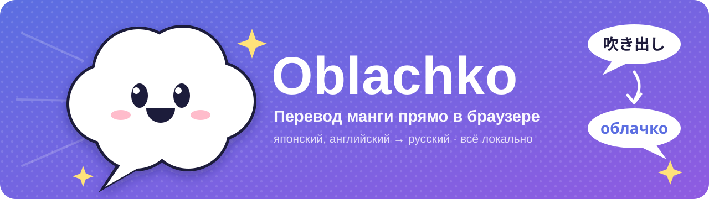
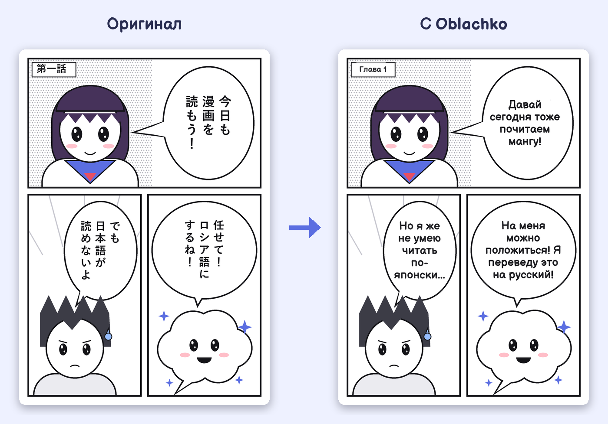
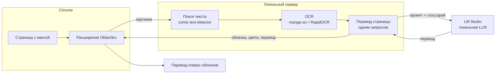

<p align="center">
  
</p>

<p align="center">
  <a href="https://github.com/BasteArima/Oblachko/releases/latest"></a>
  
  
  
</p>

<p align="center">
  <b>Расширение для Chrome, которое переводит мангу прямо на странице.</b><br>
  Находит облачка с репликами, распознаёт японский или английский текст и вписывает на его место русский перевод.<br>
  Всё работает у вас на компьютере: никаких облачных сервисов, лимитов и подписок.
</p>

<p align="center">
  
</p>

<p align="center"><sub>Демо-страница нарисована специально для README; перевод и раскладка текста получены настоящим Oblachko.</sub></p>

## ✨ Возможности

- **Сама страница, а не отдельное окно.** Перевод ложится поверх облачков, шрифт подбирается под размер облачка. Зажмите <kbd>Alt</kbd>, чтобы подсмотреть оригинал.
- **Читает наперёд.** Страница на экране переводится первой, следующие переводятся заранее, пока вы читаете. Повторное открытие главы мгновенное: переводы кэшируются.
- **Помнит персонажей.** Имена запоминаются для каждого тайтла, так что героиня не превращается из «Наоко» в «Нако» через страницу. Неудачное имя можно исправить в попапе, и страница переведётся заново.
- **Работает почти везде.** Обычные ``, читалки на `<canvas>`, страницы в CSS-фоне, CDN с защитой от хотлинка, длинные ленты вебтунов. Если картинку нельзя прочитать, страница вырезается из снимка вкладки.
- **Японский и английский.** Вертикальный текст, фуригана, английский капс; водяные знаки сканлейтеров отбрасываются. На английских страницах текст дополнительно ищется по всей странице, так что переводятся и подписи вне облачков, имена и звуки.
- **Обновляется сама.** `start.bat` при запуске скачивает новую версию и обновляет и сервер, и расширение.

## 🧩 Как это работает



Расширение отправляет страницу на локальный сервер. Сервер находит блоки текста, распознаёт их, собирает реплики в порядке чтения и переводит всю страницу одним запросом к модели в LM Studio: так модель видит контекст диалога, предыдущую страницу и глоссарий имён. Расширение рисует ответ поверх картинки, не трогая вёрстку сайта.

## 🚀 Установка

**Нужно:** Windows, видеокарта NVIDIA от 8 ГБ, Google Chrome, [LM Studio](https://lmstudio.ai).

1. **uv** (ставит Python и библиотеки сам). Один раз в PowerShell:
   ```powershell
   powershell -ExecutionPolicy ByPass -c "irm https://astral.sh/uv/install.ps1 | iex"
   ```
2. **Oblachko.** Скачайте `Oblachko-vX.Y.Z.zip` из [последнего релиза](https://github.com/BasteArima/Oblachko/releases/latest) и распакуйте в постоянное место, например `C:\Oblachko`.
3. **LM Studio.** Скачайте модель, на вкладке *Developer* загрузите её с контекстом 4096 и нажмите *Start Server*.
4. **Сервер.** Запустите `start.bat`. Первый раз он скачает всё нужное (несколько ГБ, 5–15 минут). Готово, когда в окне появится `Uvicorn running on http://127.0.0.1:8765`.
5. **Расширение.** `chrome://extensions` → включите «Режим разработчика» → «Загрузить распакованное расширение» → папка `extension` внутри Oblachko.

Дальше каждый раз: LM Studio с сервером, `start.bat`, глава манги, иконка Oblachko → «Переводить на этом сайте».

Если LM Studio слушает не порт 1234, поменяйте `llm_base_url` в `server\config.toml`.

### Какую модель взять

| Видеопамять | Модель | Заметки |
|---|---|---|
| 8 ГБ | Qwen 3.5 9B, Q4 (~6 ГБ) | Контекст 4096. Сам Oblachko занимает ~0,8 ГБ, Windows и Chrome ~1 ГБ. |
| 8 ГБ | Gemma 4 12B QAT (~6,7 ГБ) | Лучше переводит, но пару слоёв придётся выгрузить на процессор в LM Studio: медленнее. |
| 12 ГБ и больше | Gemma 4 12B QAT | Рекомендуется. 1–3 секунды на страницу. |

## 🎛 Использование

| Где | Что |
|---|---|
| Иконка на панели | Включить перевод на сайте, выбрать язык оригинала, статус сервера и модели |
| <kbd>Alt</kbd> (зажать) | Показать оригинал |
| Попап → «Имена в этом тайтле» | Исправить имена персонажей; страница переведётся заново |
| Попап → «Повторить» | Перевести заново страницы с ошибкой |
| Красный **!** на странице | Наведите курсор: там текст ошибки |

## 🩹 Если что-то не так

| Симптом | Что сделать |
|---|---|
| «Сервер не отвечает» | Запустите `start.bat` и не закрывайте его окно |
| «LLM недоступна» | Запустите сервер в LM Studio; проверьте порт в `server\config.toml` |
| Перевод не появляется | Включите «Переводить на этом сайте» в попапе; посмотрите ошибку там же |
| «Покажите страницу целиком» | Сайт не отдаёт картинку, и страница снимается со скриншота: прокрутите так, чтобы она была видна вся |
| Имя переведено странно | Попап → «Имена в этом тайтле», исправьте и сохраните |

## 🛠 Для разработчиков

```
extension/   расширение Chrome (TypeScript, Vite, CRXJS)
  src/background/   service worker: связь с сервером, Referer, снимки вкладки, автообновление
  src/content/      поиск страниц, очередь, отрисовка перевода
  src/popup/        попап: настройки сайта, глоссарий, ошибки
server/      локальный сервер (Python, FastAPI)
  app/pipeline/     детектор, OCR, облачка, перевод
  app/worker.py     очередь на GPU, кэш, контекст главы, глоссарий
  update.py         самообновление из релизов GitHub
tools/       сборка релиза, демо-картинка для README
start.bat    запуск для пользователей
VERSION      единая версия сервера и расширения
```

**Сервер:**

```bash
cd server
uv sync
uv run python -m app                               # http://127.0.0.1:8765
uv run python scripts/bench.py "../test_pages/ja/*.webp"   # замеры и отладочные картинки
```

**Расширение:**

```bash
cd extension
npm install
npm run dev     # пересборка при изменениях; затем ↻ в chrome://extensions
npm run build
```

**Релиз.** Поднимите номер в `VERSION`, закоммитьте и запушьте тег с тем же номером:

```bash
git tag v0.2.0
git push origin v0.2.0
```

GitHub Actions соберёт расширение и выложит архив из `tools/package.py`; у пользователей он подтянется при следующем запуске `start.bat`. Демо-картинку для README пересобирает `tools/make_demo.py` (нужны запущенные сервер и LM Studio).

## 🙏 Спасибо

- [comic-text-detector](https://github.com/dmMaze/comic-text-detector) и модель из [manga-image-translator](https://github.com/zyddnys/manga-image-translator): поиск текста
- [manga-ocr](https://github.com/kha-white/manga-ocr): японский OCR
- [RapidOCR](https://github.com/RapidAI/RapidOCR): английский OCR
- [Balsamiq Sans](https://github.com/balsamiq/balsamiqsans): шрифт перевода (SIL Open Font License, `extension/public/fonts/OFL.txt`)
